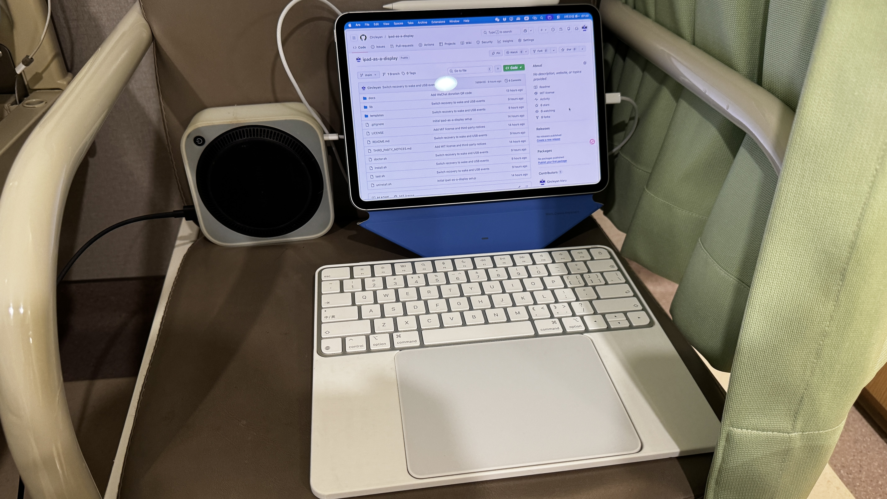

# ipad-as-a-display

让 iPad 成为 Mac mini 的可插拔屏幕。



一句话说明：

第一次用一台普通显示器把它装好。以后拔掉 USB-C，iPad 立刻回到普通 iPad；重新插回 USB-C，或者先唤醒 Mac mini 再插线，iPad 又会变成 Mac 的屏幕。

## 适合谁

这个项目适合你，如果你满足这些条件：

- 你在用 `Mac mini`
- 你想把 `iPad` 通过 `USB-C` 当作主要工作屏
- 你接受首次安装时先接一台普通显示器
- 你接受 `BetterDisplay` 在后台作为显示锚点
- 你接受这是一套实用工作流，不是 Apple 官方提供的无头模式

## 它会帮你做什么

- 提供一个可以直接双击的 `Start.command`
- 在真正安装前先做一轮 preflight 体检
- 自动下载并安装 `SidecarLauncher`
- 安装一个本地监听器，在 `Mac 唤醒` 和 `USB 变化` 时尝试恢复 Sidecar
- 可选把 iPad 固定为主屏
- 提供 `test.sh`、`doctor.sh`、`uninstall.sh`

## 第一次安装

第一次安装前，请先确认：

- `BetterDisplay` 已安装
- `iPad` 和 `Mac mini` 用的是同一个 Apple Account
- `Mac mini` 已开启自动登录
- `iPad` 已通过 `USB-C` 连上，并且已经解锁
- 第一次安装时，`Mac mini` 仍接着一台普通显示器

然后只做这一件事：

1. 直接双击 `Start.command`

它会自动帮你做这几件事：

- 检查 `BetterDisplay`、`swiftc` 和基础命令是否齐全
- 下载 `SidecarLauncher`
- 让你选择要使用的 iPad
- 安装本地监听器和 LaunchAgent
- 自动跑一次连接测试

安装过程中你通常只需要做两件事：

1. 选择要使用的 iPad
2. 选择是否始终把 iPad 设为主屏

如果 macOS 第一次阻止双击运行，右键 `Start.command`，选择“打开”一次就行。

如果你更习惯命令行，也可以执行：

```zsh
chmod +x Start.command install.sh test.sh doctor.sh uninstall.sh
./Start.command
```

如果安装时报 `swiftc` 缺失，先执行：

```zsh
xcode-select --install
```

然后重新双击 `Start.command`。

## 怎么算成功

只看这四件事：

- iPad 已经显示 macOS 桌面
- 拔掉 `USB-C` 后，iPad 立刻回到普通 iPad
- 重新插回 `USB-C` 并解锁后，iPad 能恢复成显示器
- 如果 Mac mini 先睡眠，再由键盘或板子唤醒，已插线的 iPad 也能恢复

## 日常使用

日常使用只有两种动作。

结束使用时：

1. 直接拔掉 `USB-C`
2. iPad 立刻回到普通 iPad
3. Mac mini 继续运行，或者之后自己睡眠

开始使用时：

1. 如果 Mac mini 睡眠了，先用键盘或板子唤醒它
2. 把 iPad 重新通过 `USB-C` 接回去
3. 解锁 iPad
4. 等它恢复成 Mac mini 的屏幕

## 如果没成功

先不要重装，先运行：

```zsh
./doctor.sh
```

`doctor.sh` 现在会直接告诉你属于哪一类问题，以及下一步该做什么。

优先检查这些：

- `BetterDisplay` 是否已经安装并正在运行
- iPad 是否仍然解锁，并且还能被 `SidecarLauncher` 识别
- iPad 和 Mac 是否仍然是同一个 Apple Account
- 第一次安装时，你是否还接着一台普通显示器
- 如果安装时报 `swiftc` 缺失，是否已经安装 Xcode Command Line Tools

## 这套方案怎么工作

用户层面，你只需要理解一句话：

插上就是显示器，拔掉就是 iPad。

实现层面，这个项目做了四件事：

- `BetterDisplay` 提供隐藏显示器锚点，让 Mac mini 在没有 HDMI 时也保持可用
- `SidecarLauncher` 负责从命令行重连 Sidecar
- `LaunchAgent` 负责在登录后启动本地监听器
- 本地监听器只在 `Mac 唤醒` 和 `USB 变化` 时触发恢复，不再依赖固定轮询

这也意味着：

- 当前模式优先服务“插拔式使用”
- 它不是“锁屏后持续自愈”的方案
- `SidecarLauncher` 使用私有 API，未来的 macOS 更新可能会让这套方案失效

## 仓库文件

- `Start.command`：给普通用户双击的一键入口
- `install.sh`：首次安装、写入配置、编译本地监听器、安装 LaunchAgent，并自动跑一次测试
- `test.sh`：手动再跑一次恢复测试
- `doctor.sh`：检查当前安装状态，并直接给出诊断和下一步动作
- `uninstall.sh`：移除已安装服务

## 安装后会写入哪里

- LaunchAgent：`~/Library/LaunchAgents/local.ipad-as-a-display.plist`
- 配置文件：`~/Library/Application Support/ipad-as-a-display/config.env`
- 服务脚本：`~/Library/Application Support/ipad-as-a-display/ipad-as-a-display.sh`
- 监听器源码：`~/Library/Application Support/ipad-as-a-display/ipad-as-a-display-monitor.swift`
- 监听器二进制：`~/Library/Application Support/ipad-as-a-display/ipad-as-a-display-monitor`
- 标准日志：`/tmp/ipad-as-a-display.log`
- 错误日志：`/tmp/ipad-as-a-display.err`

## 卸载

```zsh
./uninstall.sh
```

## Support

This project stays open source.

如果它帮你节省了时间，并且你愿意支持后续维护，可以“请我一杯咖啡”。

这是可选捐赠，不是购买，不影响你正常使用这个项目。

建议金额：`9.9 RMB`

微信赞赏码：


## License

This project is open source under the MIT License. See [LICENSE](./LICENSE).

## Acknowledgements

- This project uses [Ocasio-J/SidecarLauncher](https://github.com/Ocasio-J/SidecarLauncher) to trigger Sidecar connections from the command line
- `SidecarLauncher` is open source under the MIT License
- See [THIRD_PARTY_NOTICES.md](./THIRD_PARTY_NOTICES.md) for third-party licensing notes

<details>
<summary>English Summary</summary>

`ipad-as-a-display` turns an iPad into a practical plug-in display for a Mac mini.

First-time setup still needs a normal monitor. After setup:

- unplug USB-C and the iPad returns to normal iPad mode
- plug USB-C back in, or wake the Mac mini and then plug it in, and the iPad returns as the display

The easiest path is to double-click `Start.command`, which runs preflight checks, installs the local helper, and performs one automatic test.

This project uses:

- `BetterDisplay` as the hidden display anchor
- `SidecarLauncher` for Sidecar reconnection
- a local LaunchAgent and monitor process that react to wake and USB events

</details>
