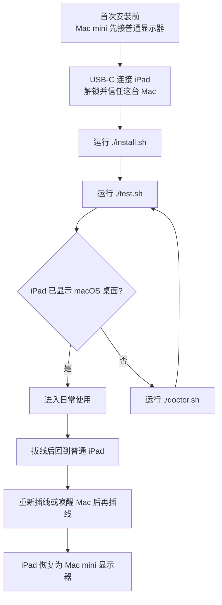
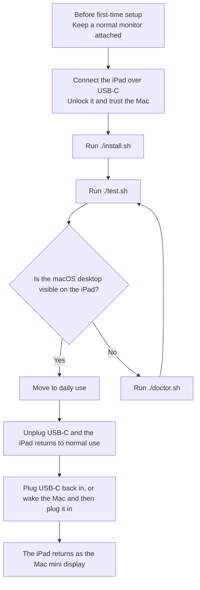

# ipad-as-a-display

让 iPad 成为没有常驻显示器的 Mac mini 的可插拔主屏。

## 中文

### 先告诉使用者什么

只需要先让使用者知道这四件事：

1. 首次安装时，Mac mini 必须先接着一台正常显示器。
2. 安装时只做两步：先跑 `./install.sh`，再跑 `./test.sh`。
3. 日常使用时，拔掉 USB-C，iPad 就回到普通 iPad；重新插回 USB-C，或先唤醒 Mac 再插线，iPad 会重新变成显示器。
4. 如果没有成功，不要先重装，先跑 `./doctor.sh` 看状态。

### 使用路线图



### 现在就怎么做

1. 给 Mac mini 接上一台普通显示器。
2. 用 USB-C 连接 iPad，并解锁它。
3. 如果 iPad 弹出“信任这台 Mac”，选择信任。
4. 确认 `BetterDisplay` 已安装。
5. 运行：

```zsh
chmod +x install.sh test.sh doctor.sh uninstall.sh
./install.sh
./test.sh
```

### 日常使用

- 不用时，直接拔掉 USB-C，iPad 立刻回到普通 iPad。
- 下次再用时，先唤醒 Mac mini，再插回 USB-C，解锁 iPad。
- 这套方案不再依赖固定 `15s` 轮询，而是由唤醒事件和 USB 变化触发恢复。

### 成功的标准

只看这四点：

- iPad 已经显示 macOS 桌面
- 拔掉 USB-C 后，iPad 立刻回到普通 iPad
- 重新插回 USB-C 并解锁后，iPad 能恢复成显示器
- 如果 Mac mini 先睡眠，再由键盘或板子唤醒，已插线的 iPad 也能恢复

### 如果没成功

先运行：

```zsh
./doctor.sh
```

先看这几个问题：

- `BetterDisplay` 是否已经安装并正在运行
- iPad 是否仍然解锁，并且还能被 `SidecarLauncher` 识别
- iPad 和 Mac 是否还在同一个 Apple Account 下
- 你是不是在第一次安装前就已经把显示器拔掉了
- 如果安装时报 `swiftc` 缺失，是否已经安装 Xcode Command Line Tools

<details>
<summary>完整说明</summary>

#### 这个项目做了什么

- `BetterDisplay` 提供隐藏显示器锚点，让 Mac mini 在没有 HDMI 时也保持可用
- `SidecarLauncher` 负责从命令行重连 Sidecar
- `LaunchAgent` 会启动一个本地监听器，监听 `Mac 唤醒` 和 `USB 设备变化`
- 检测到这些事件时，脚本才会尝试恢复 iPad 显示

#### 环境前提

- 设备是运行 macOS 的 Mac mini
- 已安装 `BetterDisplay`
- iPad 和 Mac 使用同一个 Apple Account
- Mac 已开启自动登录
- 首次安装时，Mac 仍接着一台正常显示器
- 首次安装时，iPad 可以通过 USB-C 解锁并信任这台 Mac
- 如果安装时缺少 `swiftc`，需要先安装 Xcode Command Line Tools

#### 仓库文件

- `install.sh`：首次安装、写入配置、编译本地监听器、安装 LaunchAgent
- `test.sh`：立即执行一轮恢复，并打印当前状态
- `doctor.sh`：查看当前健康状态与日志
- `uninstall.sh`：移除已安装服务

#### 安装后会写入哪里

- LaunchAgent：`~/Library/LaunchAgents/local.ipad-as-a-display.plist`
- 配置文件：`~/Library/Application Support/ipad-as-a-display/config.env`
- 服务脚本：`~/Library/Application Support/ipad-as-a-display/ipad-as-a-display.sh`
- 监听器源码：`~/Library/Application Support/ipad-as-a-display/ipad-as-a-display-monitor.swift`
- 监听器二进制：`~/Library/Application Support/ipad-as-a-display/ipad-as-a-display-monitor`
- 标准日志：`/tmp/ipad-as-a-display.log`
- 错误日志：`/tmp/ipad-as-a-display.err`

#### 卸载

```zsh
./uninstall.sh
```

#### 注意事项

- 当前恢复模式是 `wake + USB replug`，不是“锁屏后持续自愈”
- `BetterDisplay` 是实现细节。用户只需要理解：插上就是显示器，拔掉就是 iPad
- `SidecarLauncher` 使用私有 API，未来的 macOS 更新可能会让这套方案失效

</details>

<details>
<summary>展开英文版</summary>

### What users need to know first

Keep the message simple:

1. For first-time setup, the Mac mini must still have a normal monitor attached.
2. Setup is only two actions: run `./install.sh`, then run `./test.sh`.
3. In daily use, unplugging USB-C returns the iPad to normal iPad mode; plugging it back in, or waking the Mac and then plugging it in, restores the display.
4. If it does not work, do not reinstall first. Run `./doctor.sh` first.

### User Flow



### Quick Start

1. Attach a normal monitor to the Mac mini.
2. Connect the iPad over USB-C and unlock it.
3. Trust the Mac on the iPad if prompted.
4. Make sure `BetterDisplay` is installed.
5. Run:

```zsh
chmod +x install.sh test.sh doctor.sh uninstall.sh
./install.sh
./test.sh
```

### Daily Use

- Unplug USB-C when you want the iPad back as a normal iPad.
- Wake the Mac mini, reconnect USB-C, and unlock the iPad when you want the display back.
- Recovery is event-driven through wake and USB changes, not fixed-interval polling.

### Success Looks Like This

- the iPad shows the macOS desktop
- unplugging USB-C returns the iPad to normal iPad mode
- plugging USB-C back in and unlocking the iPad restores the display
- if the Mac sleeps first, waking it with the keyboard or trackpad also restores the connected iPad

### If It Does Not Work

Run:

```zsh
./doctor.sh
```

Check these first:

- is `BetterDisplay` installed and running
- is the iPad unlocked and still visible to `SidecarLauncher`
- are both devices still on the same Apple Account
- did you keep a physical monitor attached during first-time setup
- if install reports missing `swiftc`, did you install Xcode Command Line Tools

### Full Notes

- `install.sh`: first-time setup, config writing, local monitor build, LaunchAgent install
- `test.sh`: run one recovery cycle and show status
- `doctor.sh`: print current health and logs
- `uninstall.sh`: remove the installed service
- LaunchAgent: `~/Library/LaunchAgents/local.ipad-as-a-display.plist`
- Config: `~/Library/Application Support/ipad-as-a-display/config.env`
- Service script: `~/Library/Application Support/ipad-as-a-display/ipad-as-a-display.sh`
- Monitor source: `~/Library/Application Support/ipad-as-a-display/ipad-as-a-display-monitor.swift`
- Monitor binary: `~/Library/Application Support/ipad-as-a-display/ipad-as-a-display-monitor`
- Log: `/tmp/ipad-as-a-display.log`
- Error log: `/tmp/ipad-as-a-display.err`

</details>

## Support

This project stays open source.

如果它帮你节省了时间，并且你愿意支持后续维护，可以“请我一杯咖啡”。

这是可选捐赠，不是购买，不影响你正常使用这个项目。

建议金额：`9.9 RMB`

微信赞赏码：


## License

This project is open source under the MIT License. See [LICENSE](./LICENSE).

## Acknowledgements

- This project uses [Ocasio-J/SidecarLauncher](https://github.com/Ocasio-J/SidecarLauncher) to trigger Sidecar connections from the command line
- `SidecarLauncher` is open source under the MIT License
- See [THIRD_PARTY_NOTICES.md](./THIRD_PARTY_NOTICES.md) for third-party licensing notes
